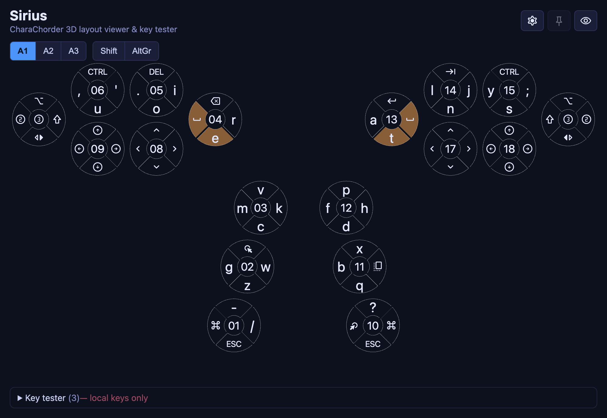

# Sirius

[](https://github.com/andy23512/sirius/actions/workflows/ci.yml)



A cross-platform desktop key tester for CharaChorder 3D devices, built with
**Angular 20** + **Electron**. It has two parts:

> The screenshot is generated with `npm run screenshot`
> ([tools/screenshot.cjs](tools/screenshot.cjs)).

1. **Layout viewer** — draws the CharaChorder 3D layout as SVG and shows each
   key's character/label. Supports selecting a built-in device layout, uploading
   your own device layout, and selecting an OS keyboard layout (QWERTY, AZERTY,
   Bopomofo, …). Layer / Shift / AltGr toggles reveal the other layers and
   highlight the keys you must hold to reach them. **Pressed keys light up live**
   on the layout (red) — press a key and its position glows.
2. **Global key tester** — detects keystrokes **globally** (including keys pressed
   in other applications) and prints the obtainable info for each key (name, raw
   keycode, DOM code, active modifiers). Collapsible panel at the bottom.

Both parts share a single `GlobalKeyService`. When the Electron bridge is present
it captures keys from any application; in a plain browser it falls back to DOM key
events (this window only) — enough to try the live highlighting during development.

## Desktop window modes

The header has three buttons:

- **⚙ Settings** — opens a dialog with the device-layout select, upload, OS-layout
  select, and the 3rd-thumb-switch toggle (`src/app/settings-dialog/`). These were
  moved out of the main view to keep it clean.
- **📌 Pin to front** — `setAlwaysOnTop(true, 'screen-saver')`, floats above other
  windows (incl. full-screen apps).
- **Passthrough overlay** (eye icon) — transparent background, hides all chrome
  (only the layout floats), and makes the window **click-through** so you can type
  in the app underneath while watching keys light up on the overlay. A small
  **controls cluster** stays in the top-right corner — a **move grip** (drag it to
  reposition the overlay) and an **exit button** — kept interactive while the rest
  of the window is click-through via the hover-forward technique (`forward:true` +
  `setIgnoreMouseEvents`, as in aqua-sprite); dragging the grip moves the window
  via `moveBy` IPC (`win.setPosition`). The global shortcut **⌘/Ctrl + Shift + O**
  also toggles the mode (and works in a plain browser while focused).
- **🪟 Window frame** — switches between the frameless overlay window and the
  **normal OS-framed window** (the "original" look, with the native title bar and
  traffic-light buttons). `frame`/`transparent` can't be toggled after creation, so
  this recreates the window (the renderer reloads; the layout/OS selection persist).
  Passthrough needs transparency, so it's disabled while framed.

The Electron window starts frameless + transparent (`electron/main.js`); the
renderer paints an opaque background in normal mode and goes fully transparent in
passthrough. The header is the drag region. Window state lives in the main process
and is exposed to the renderer via `window.sirius.windowControls` (`WindowService`).

The **window position/size and the pin/frame state are persisted** across launches
(`window-state.json` in the app's userData; passthrough is never restored, and
off-screen bounds fall back to defaults). Entering passthrough **auto-enables
pin-to-front** so the overlay floats above other windows, and exiting restores the
previous pin state.

### Tray icon

A **tray / menu-bar icon** (a hand-rasterized star — no asset file; `makeStarIcon`
generates a template PNG at runtime). **Left-click toggles the window** (show /
hide); **right-click opens the menu** (macOS/Windows use the `click`/`right-click`
events + `popUpContextMenu`; Linux keeps a persistent `setContextMenu` since its
click events are unreliable). The menu mirrors the header controls: **Settings…**,
**Pin to front**, **Passthrough overlay**, **Window frame** (all checkboxes
reflecting the live state), plus **Show window** and **Quit**. On macOS/Windows the
menu is rebuilt on each right-click so the checkmarks are always current. Choosing
**Settings…** from the tray leaves passthrough (so the window is interactive),
shows the window, and tells the renderer to open the dialog (`menu-open-settings`
→ `WindowService.settingsRequested`). This makes the app usable even while it's a
click-through overlay or its window is closed (on macOS, closing the window keeps
it alive in the tray).

## Theme

The palette is defined once in `src/styles.scss` (`:root` CSS variables) and named
after the star: **Sirius** is spectral type A1V — blue-white. Deep night-sky navy
base (`--sirius-bg`), a blue-white azure accent for highlights/active controls
(`--sirius-accent`), and a warm amber "twinkle" for live key presses
(`--sirius-pressed`). Change those three variables to re-theme the whole app.

### How live highlighting works

The Electron main process maps each uiohook keycode to a DOM `code` string
(`KeyA`, `Space`, …) and forwards it. The renderer builds a `code → position`
map from the selected device layout (`src/app/layout-viewer/code-to-positions.ts`)
and lights the matching positions. This is **layout-independent**: a device
position emits a fixed HID key regardless of the OS keyboard layout, so the
mapping does not depend on the selected OS layout. The two device space keys both
emit `Space`, so a space press lights both.

### Limitations of live highlighting

Highlighting works by reverse-mapping the **standard keyboard keystroke** the OS
receives back to a layout position. Anything that doesn't produce a plain,
one-to-one keyboard keystroke can't be reflected accurately. Known cases:

- **CharaChorder-specific non-standard keys (`tangent-cc-lib` `NON_KEY_ACTIONS`).**
  These emit no standard keyboard keystroke (or emit a non-keyboard event), so the
  global keyboard hook can't attribute them to a position. This whole family is
  unsupported, including:
  - **Layer / keymap switches** — `PrimaryKeymapLeft/Right`,
    `SecondaryKeymapLeft/Right`, `TertiaryKeymapLeft/Right`,
    `QuaternaryKeymapLeft/Right`. (The layer _follows_ the key you then type, but
    the switch key itself never lights.)
  - **Mouse actions** — `MouseLeftClick`, `MouseRightClick`, `MouseMiddleClick`,
    `MouseMove*`, `MouseScrollCoast*` (these are mouse events; we only hook the
    keyboard).
  - **Media / consumer-control keys** — `PlayPause`, `NextTrack`,
    `PreviousTrack`, `Mute`, `VolumeUp`, `VolumeDown`, `BrightnessUp`,
    `BrightnessDown`, `Search`, `Back`, `Forward` (HID consumer usages, not
    standard keycodes; libuiohook doesn't report them reliably).
  - **Device-internal / chording sequencer functions** — `Dup`, `GTM`,
    `Impulse`, `PressNext`, `ReleaseNext`, `HoldCompound`, `ReleaseCompound`,
    `Join`, `Delay1Ms`, `AmbidextrousThrowoverLeft/Right`, `RestartInputDevice`,
    `NoKeyPressed`, the per-switch `…Center` remaps, and `NoBreakSpace`.
- **Keys with a built-in Shift** (a layout key whose action has `withShift`, e.g.
  `?` = `Shift`+`Slash`, or `!` = `Shift`+`1`). Such a position lights **only while
  Shift is held**, so pressing `/` on its own no longer lights `?`. The remaining
  ambiguity is the reverse: because that key auto-emits `Shift`+code, pressing it
  looks identical to pressing the base key while a Shift key is held — so both the
  shifted position and the unshifted one (plus the Shift position) light together.
- **Chord output.** Pressing a chord (several positions at once) makes the device
  emit a burst of keystrokes (and backspaces) for the whole output word. The
  positions that light up reflect the letters of the **output**, not the physical
  chord that was pressed.
- **Alt Codes** (`WindowsAltCode` actions). The character is typed via an
  `Alt`+numpad sequence (Windows only); the hook sees the `Alt`/numpad events, not
  the position that triggered them.
- **Keyboard remapping / customization tools** (Karabiner-Elements, AutoHotkey,
  PowerToys Keyboard Manager, `hidutil`, etc.). If the OS remaps a key _after_ the
  device sends it, the hook sees the **remapped** key, so the position that lights
  reflects the remap — not the physical key pressed on the device.
- **Ambiguous keys.** A key that exists on several positions or layers lights
  **every** matching position — there's no way to tell which physical key was
  pressed (e.g. both space keys, or a letter that appears in more than one place).
- **Uncommon keycodes.** International/less-common keys (`IntlBackslash`,
  `IntlRo`, `IntlYen`, some `Numpad*` variants) may have no matching DOM `code`
  from the hook and won't light.

Note that the _character labels_ also assume the selected OS keyboard layout
matches the OS's actual active layout; if they differ, the labels are wrong even
though the positions still light correctly (position mapping is layout-independent).

## Layout viewer

Reuses [`tangent-cc-lib`](https://www.npmjs.com/package/tangent-cc-lib) for the
core CharaChorder data: physical position geometry (`POSITION_CODE_LAYOUT`),
built-in device layouts, all OS keyboard layouts, the action table, and the
code→character mapping. The SVG rendering (`src/app/layout-viewer/`) is ported
from the Alnitak project's Layout Viewer.

- **Select device layout** — dropdown of built-ins (`cc1-cc2-default`,
  `m4g-default`, `cclite-default`, …) plus any uploaded layouts.
- **Upload device layout** — accepts a CharaChorder backup
  (`{ history: [[ { type:'layout', device, layout } ]] }`) or a bare
  `{ layout: [...] }`; stored in `localStorage`.
- **Select OS layout** — 220+ keyboard layouts with search; defaults to `US`.

Icon labels (Backspace, arrows, ⌘, mouse, counters, …) are rendered with the
**Material Symbols Rounded** font using its ligatures (`font-feature-settings:
'liga'`), which do form inside SVG `<text>` with this font. OS logos use
`font-logos`.

Only the subset **`material-symbols-rounded.min.woff2`** (~60 KB) is committed and
bundled (it's what `@font-face` in `src/styles.scss` references). It's produced by
`npm run subset-icon-font` ([tools/subset-icon-font.mjs](tools/subset-icon-font.mjs)),
which keeps only the icons in tangent-cc-lib's `KeyLabelIcon` type plus the app's
own UI icons (`UI_ICONS` in the tool — the toolbar/dialog button glyphs).

The **full** source font (~4.4 MB, `src/assets/material-symbols-rounded.woff2`) is
**gitignored** to keep the repo lean — you only need it to re-subset. To re-run
the subset (e.g. after changing the icon set), fetch "Material Symbols Rounded"
(full latin woff2) — from
[`@fontsource-variable/material-symbols-rounded`](https://www.npmjs.com/package/@fontsource-variable/material-symbols-rounded)
or the alnitak repo — put it at `src/assets/material-symbols-rounded.woff2`, then
run `npm run subset-icon-font` (it prints these instructions if the file is
missing). UI button icons use the `.material-symbol` class (ligatures work in HTML
`<button>`s, unlike SVG `<text>`).

Pressing a key also **follows the typed layer**: if the pressed key only exists
on a non-primary layer (e.g. a number on the 2nd layer), the viewer switches to
that layer so the correct label is shown.

## Tests

```bash
npm run test:ci   # headless single run (ChromeHeadlessNoSandbox)
npm test          # watch mode
```

CI runs `test:ci` + `build` on every push (to `main`/`master`) and pull request
via GitHub Actions ([.github/workflows/ci.yml](.github/workflows/ci.yml)). The
`ChromeHeadlessNoSandbox` launcher (in `karma.conf.js`) adds `--no-sandbox` so the
tests run on CI runners.

The live-highlighting logic is covered by unit tests:

- `src/app/layout-viewer/code-to-positions.spec.ts` — the pure mapping functions
  against a controlled device-layout fixture: letter / number / **F1–F12** /
  modifier keys map to the right positions, both device space keys normalize to
  `Space`, `Shift + letter` and `Shift + number` light both positions,
  `buildCodeToLayers` puts numbers on the secondary layer, and `liveModifiers`
  detects Shift / AltGr.
- `src/app/layout-viewer/layout-viewer.component.spec.ts` — the view follows live
  input: **holding Shift switches to the Shift variant** (and back on release),
  AltRight → AltGr, the manual toggle still works, and pressing a number
  auto-switches to the layer that produces it.

Not unit-tested (needs the real OS hook / a physical device): the global keyboard
capture itself and the Electron window behaviours — see the limitations above.

## Architecture

- **Electron main** (`electron/main.js`) — owns a global keyboard hook via
  [`uiohook-napi`](https://github.com/SnosMe/uiohook-napi). It normalizes each
  `keydown` / `keyup` event, logs it to the terminal, and forwards it to the
  renderer over IPC.
- **Preload** (`electron/preload.js`) — exposes a minimal, sandboxed
  `window.sirius.onKey(cb)` bridge (context isolation on, node integration off).
- **Renderer** (`src/app/`) — an Angular app that subscribes to the bridge and
  shows a live event log.

## Prerequisites

- Node.js 24 (tested on v24.8.0)
- On **macOS**, global capture requires granting the app **Accessibility** (and
  **Input Monitoring**) permission — see below.

## Run

```bash
# Dev: Angular dev server + Electron (hot reload of the renderer)
npm run electron:dev

# Prod-style: build the Angular bundle, then launch Electron against it
npm run electron:build
```

The renderer alone (`npm start`, http://localhost:4200) shows a "not connected"
banner because the global hook only exists inside Electron.

## Packaging

Distributable builds are produced with **electron-builder** (config in the
`build` field of `package.json`); output goes to `release/`.

```bash
npm run dist        # build + package for the current OS (.dmg / .exe / AppImage)
npm run dist:dir    # build + unpacked app only (faster, for smoke-testing)
npm run make-icon   # regenerate build/icon.png (the star app icon)
```

Notes:

- The Angular renderer is pre-bundled into `dist/`, so the **only runtime
  dependency is `uiohook-napi`** — everything else lives in `devDependencies`, so
  electron-builder ships a lean app. The native module is unpacked from the asar
  (`asarUnpack`) so its `.node` binary can load.
- The app icon is derived from `build/icon.png` (`npm run make-icon`, a Sirius
  blue-white star).
- Because the packaged app's identity is **Sirius** (not `Electron`), it appears as
  “Sirius” in System Settings → Accessibility — grant it there for global capture.

### Releases

Pushing a version tag builds installers for macOS, Windows and Linux and attaches
them to a GitHub Release ([.github/workflows/release.yml](.github/workflows/release.yml)):

```bash
npm version 1.2.0        # bump package.json (creates a matching commit + tag)
git push --follow-tags   # pushes the v1.2.0 tag → triggers the release workflow
```

The artifacts are **unsigned** (see below), so:

- **macOS** — right-click the app → **Open** (or `xattr -dr com.apple.quarantine
/Applications/Sirius.app`) to get past Gatekeeper.
- **Windows** — SmartScreen: **More info → Run anyway**.
- **Linux** — `chmod +x Sirius-*.AppImage` and run it.

### Signing & notarization (macOS)

The mac config is **ready to sign + notarize**, and gracefully produces an
**unsigned** app when no credentials are present (as above — good for local
testing / CI). To distribute outside your own machine you must sign + notarize,
or Gatekeeper blocks the app. You need an **Apple Developer account** and a
**Developer ID Application** certificate in your keychain (or via `CSC_LINK` /
`CSC_KEY_PASSWORD`).

The config already sets `hardenedRuntime`, `build/entitlements.mac.plist` (JIT +
`disable-library-validation` so the `uiohook-napi` `.node` loads), and an
`afterSign` hook (`build/notarize.cjs`) that notarizes **only** when Apple
credentials are in the environment. Provide **one** of:

```bash
# App Store Connect API key (recommended)
export APPLE_API_KEY=/path/to/AuthKey_XXXX.p8
export APPLE_API_KEY_ID=XXXXXXXXXX
export APPLE_API_ISSUER=xxxxxxxx-xxxx-xxxx-xxxx-xxxxxxxxxxxx

# …or Apple ID + app-specific password
export APPLE_ID=you@example.com
export APPLE_APP_SPECIFIC_PASSWORD=xxxx-xxxx-xxxx-xxxx
export APPLE_TEAM_ID=XXXXXXXXXX

npm run dist   # signs, notarizes, staples, and builds the .dmg
```

Verify afterward with `spctl -a -vvv "release/mac-arm64/Sirius.app"` and
`xcrun stapler validate`. For CI signing, put the cert (`CSC_LINK` base64 +
`CSC_KEY_PASSWORD`) and the Apple credentials above into repository secrets and
run `npm run dist` on a `macos-latest` runner.

## macOS permission

The first time the app runs, macOS blocks the global hook until you grant
permission. Open **System Settings → Privacy & Security**, then enable the app
(during development this appears as **Electron**) under both:

- **Accessibility**
- **Input Monitoring**

Restart the app after granting. Without this, the window still opens but no key
events are captured.

The app detects this automatically: on macOS the main process checks
`systemPreferences.isTrustedAccessibilityClient`, and if the permission is
missing the renderer shows a banner with an **Open Settings** button (deep-links
to the Accessibility pane). While the permission is missing the main process
polls, so the banner clears on its own once you grant it (`AccessibilityService`
← `window.sirius.accessibility`). On non-macOS platforms no permission is needed
and the banner never shows.

## Platform notes

- **macOS** — needs the Accessibility permission above. The frameless/transparent
  overlay, click-through, always-on-top and tray all work. Distributed builds must
  be signed + notarized (see Packaging) or Gatekeeper blocks them.
- **Windows** — the global hook works with no special permission. Transparent
  overlay + click-through work. Unsigned `.exe` installers trip SmartScreen
  ("More info → Run anyway").
- **Linux** — works under **X11** (incl. XWayland). Under a native **Wayland**
  session the global keyboard hook generally **cannot capture keys from other
  apps** (Wayland restricts global input), and transparency/click-through depend
  on the compositor. Prefer an X11 session for full functionality.

## What each event reports

| Field     | Example        | Notes                              |
| --------- | -------------- | ---------------------------------- |
| `type`    | `keydown`      | `keydown` or `keyup`               |
| `key`     | `A`            | Name derived from the keycode      |
| `keycode` | `30`           | Raw uiohook keycode (physical key) |
| modifiers | `Ctrl + Shift` | shift / ctrl / alt / meta state    |

## License

[MIT](LICENSE) © andy23512.

This is an **unofficial** tool and is not affiliated with or endorsed by
CharaChorder. The CharaChorder device data comes from
[`tangent-cc-lib`](https://www.npmjs.com/package/tangent-cc-lib).
